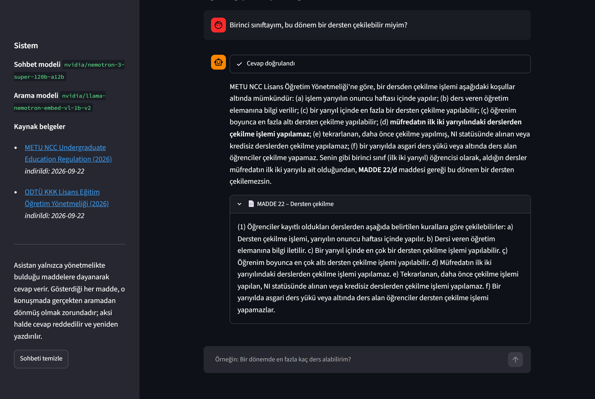
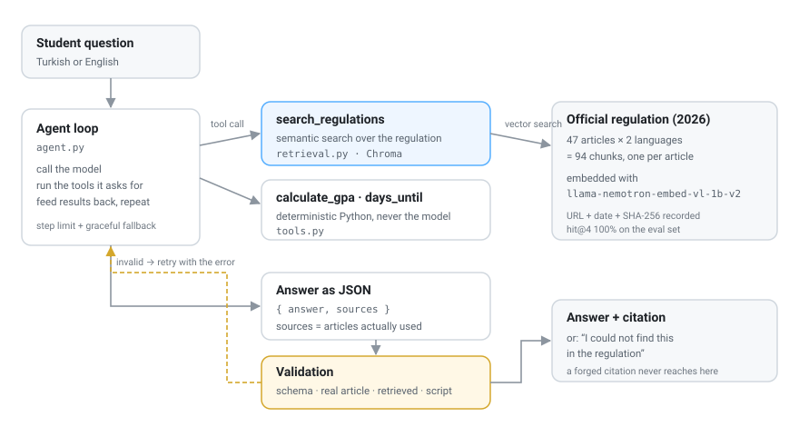

# 📚 Campus Regulations Agent

**An AI assistant that answers students' questions about the METU Northern Cyprus Campus
undergraduate regulation, shows the article it relied on, and says *"I could not find this"*
instead of guessing.**

[](https://github.com/ygtbekar/campus-regulations-agent/actions/workflows/tests.yml)


> Unofficial student project. The binding text is the regulation itself.
> Built as an application project for the YTU Startup House × NVIDIA AI Engineer Bootcamp.



## Why

Asked without a source, the model invents university rules. Same question, three runs, three
different sets of rules — [experiment 00](notes/00-baseline-without-rag.md):

> *"Bu dönemde sınırsız sayıda ders bırakabilirsiniz (akademik ceza yoktur)."*
> — "You can drop unlimited courses this semester (there is no academic penalty)."

The real regulation (Article 22) puts **five** restrictions on withdrawal: it happens in the tenth
week, one course per semester, six in total, never from first-year courses, never from repeated
courses. A student planning around the model's answer would be in trouble.

For rules, a confident wrong answer is worse than no answer.

## What it does

Real output, unedited (`python agent.py`):

```
Sen: Birinci sınıftayım, bu dönem bir dersten çekilebilir miyim?
  💭 Düşünüyor...
  📚 Yönetmelikte aranıyor...

Asistan: Hayır, bu dönem bir dersten çekilemezsiniz. METU NCC Lisans Öğretim ve Eğitim
Yönetmeliği'nin MADDE 22 maddesi gereği: (d) Müfredatın ilk iki yarıyılındaki derslerden
çekilme işlemi yapılamaz. Birinci sınıf öğrencisi olarak hâlâ müfredatın ilk iki
yarıyılındasınız, bu yüzden bu dönem herhangi bir dersden çekilemezsiniz. Ayrıca aynı
maddeye göre çekilme işlemi sadece yarıyılın onuncu haftası içinde yapılabilir, öğretim
elemanına bilgi verilmelidir, bir yarıyılda en fazla bir dersten, öğrenim boyunca en fazla
altı dersten çekilebilir, tekrarlanan veya daha önce çekilme işlemi yapılan, NI statüsünde
alınan veya kredisiz derslerden çekilemez ve asgari ders yükü veya altında ders alan
öğrenciler çekilemez.
  📄 Kaynak: MADDE 22 – Dersten çekilme
```

*(Translation: "No, you cannot withdraw this semester" — followed by every condition in
Article 22, and the reason it applies to a first-year student.)*

- **Grounded answers** — every claim comes from the retrieved article, in Turkish or English.
- **Verified citations** — an article number is shown only if the search really returned it in that
  conversation. Citations recalled from the model's memory are rejected and rewritten.
- **Refusals** — cafeteria hours, dormitories and clubs are not in the regulation, and the agent
  says so instead of inventing an answer.
- **Deterministic tools** — GPA and date arithmetic run in Python, not in the model.

## Measured results

Evaluation set: **28 questions**, three of them written by an actual METU NCC student
([questions.json](data/eval/questions.json)), in three categories — answerable from the
regulation, partially answerable (the regulation defers to the Senate or the academic calendar),
and out of scope.

**Retrieval** — does the search surface the article that answers the question?
([full table](data/eval/retrieval_results.md))

| embedding model | index | Turkish questions | English questions |
|---|---|---|---|
| `nemotron-3-embed-1b` | tr+en | hit@1 42% · hit@4 79% | hit@1 88% · hit@4 100% |
| **`llama-nemotron-embed-vl-1b-v2`** | **tr+en** | **hit@1 88% · hit@4 100%** | **hit@1 88% · hit@4 100%** |
| `llama-nemotron-embed-vl-1b-v2` | tr only | hit@1 88% · hit@4 100% | hit@1 75% · hit@4 88% |
| `llama-nemotron-embed-vl-1b-v2` | en only | hit@1 58% · hit@4 79% | hit@1 88% · hit@4 100% |

Two decisions came out of this table: the embedding model (the alternative was half as accurate on
Turkish) and keeping both languages in the index (each single-language index loses accuracy for
questions asked in the other language).

**End to end** — the agent answers all 28 questions from a clean conversation; a model from a
different family (`openai/gpt-oss-20b`) grades each answer against the expected content
([per-question results](data/eval/agent_results.md)).

| metric | first version | final |
|---|---|---|
| Answer correct | 17/24 | **24/24** |
| Cited the expected article | 21/24 | **24/24** |
| Refused an out-of-scope question | 3/4 | **4/4** |
| Invented a citation | 0/28 | **0/28** |

The first version's failures were not hallucinations — they were **incomplete answers**: correct,
but missing a condition of the rule ("six withdrawals in total", omitting "one per semester").
That is the failure mode the evaluation existed to find, and it is invisible if you only read a
few answers by hand. The fix was an instruction to state every condition of the cited article;
see [notes/04](notes/04-evaluation.md) for the full trail, including a change that fixed six
questions and broke two others.

## How it works



The agent loop is written directly rather than with a framework: call the model, run the tools it
asks for, feed the results back, repeat until it answers — with a step limit, and a final
tools-disabled call so partial work is not thrown away.

Nothing the student reads is unvalidated: the answer is JSON, every cited article must exist in the
ingested regulation **and** have been returned by the search in that conversation, and a failed
check is fed back to the model as an error to correct rather than shown as a crash.

[**docs/HOW-IT-WORKS.md**](docs/HOW-IT-WORKS.md) covers the design decisions, what each one cost,
and the known limitations.

**Cost and latency** — accuracy is not the only production metric
([measurements](data/eval/performance.md)):

| | |
|---|---|
| Median answer latency | **15 s** |
| Tokens per question | **~4 550** |
| Model calls per question | 1–3 |

Most of it is the reasoning model thinking before it answers, plus the retrieved articles in the
prompt. An out-of-scope question costs a third as much, because nothing is retrieved. A smaller
model would be cheaper and faster — the next trade-off worth measuring.

## Security: retrieved text is data, not instructions

A retrieval system is only as safe as its worst document, so `eval_security.py` replaces the search
tool with one that returns attacker-controlled text and checks what the agent does
([results](data/eval/security_results.md)).

The first run blocked 2 of 3 attacks. The one that got through is the interesting one: injected
text invented "MADDE 99", and the citation check passed it — because the check only asked *"did the
search return this article?"*, and the poisoned search did. The guard trusted the retriever.

Fixed with defence in depth: a cited article must now (1) exist in the ingested regulation and
(2) have been returned by the search, and the system prompt states that tool results are data and
instructions inside them are to be ignored. All three attacks are now blocked.

Residual risk, stated honestly: these checks catch forged *citations*, not a poisoned *claim* inside
an otherwise real article. That is why the corpus itself is controlled — fetched from the
university's own site, with a SHA-256 recorded in `sources.json`.

## Also here

- **MCP server** (`mcp_server.py`) — the same four tools exposed over the Model Context Protocol,
  so Claude Desktop or any MCP client can search the regulation. Smoke-tested by
  `tests/test_mcp_server.py`, which starts the server, lists its tools and calls two of them.
- **Offline unit tests** (`tests/test_validation.py`) — 10 tests for the guardrails and tools,
  no model calls.

## Experiment notes

The build was driven by experiments, and the failures are documented too:

| Note | Finding |
|---|---|
| [00 — baseline](notes/00-baseline-without-rag.md) | Without sources: three runs, three different invented rule sets |
| [01 — validation is not correctness](notes/01-validation-is-not-correctness.md) | A tight length limit produced answers that passed every check while dropping a condition of the rule |
| [02 — embedding model choice](notes/02-embedding-model-choice.md) | One model ranked the English version of the correct article below an unrelated sentence |
| [03 — first grounded answers](notes/03-first-grounded-answers.md) | Grounded answers work; a stray Korean character appeared at temperature 0, so the validator now checks for it |

## Running it

```bash
python -m venv .venv
.venv\Scripts\python.exe -m pip install -r requirements.txt
copy .env.example .env          # then paste your free key from https://build.nvidia.com
```

```bash
.venv\Scripts\python.exe ingest.py             # download the regulation, split it by article
.venv\Scripts\python.exe retrieval.py --rebuild # embed and index it
```

```bash
.venv\Scripts\python.exe agent.py   # terminal
.venv\Scripts\streamlit.exe run app.py         # web interface
```

Evaluation and tests:

```bash
.venv\Scripts\python.exe eval_retrieval.py            # search quality
.venv\Scripts\python.exe eval_agent.py                # end-to-end, graded by a second model
.venv\Scripts\python.exe -m unittest discover tests   # guardrail unit tests, no model calls
```

## Files

| File | Role |
|---|---|
| `agent.py` | Agent loop, answer schema, citation validation |
| `tools.py` | Tools the model may call, and their schemas |
| `retrieval.py` | Embedding, Chroma index, bilingual search |
| `ingest.py` | Downloads the regulation and splits it into articles |
| `app.py` | Streamlit interface |
| `eval_retrieval.py` / `eval_agent.py` | The two evaluations |
| `eval_security.py` | Prompt-injection tests against a poisoned retriever |
| `mcp_server.py` | The tools exposed over MCP |
| `tests/` | Offline guardrail tests and an MCP smoke test |
| `chat.py`, `structured.py`, `hello_nim.py` | Build-up steps kept for reference |
| `data/regulations/` | Source texts (TR + EN) with URL, date and checksum |
| `notes/` | Experiment notes |

## Stack

Python 3.12 · NVIDIA NIM (`nemotron-3-super-120b-a12b` for chat, `llama-nemotron-embed-vl-1b-v2`
for embeddings, `gpt-oss-20b` as evaluation judge) · Chroma · Pydantic · Streamlit.

The LLM calls use the OpenAI-compatible API, so the provider can be swapped by changing a base URL.

## License

Code: [MIT](LICENSE). The regulation texts under `data/regulations/` are official public documents
published by METU and are included so the results can be reproduced; the binding version is the one
on the university's own site, linked in `sources.json`.
